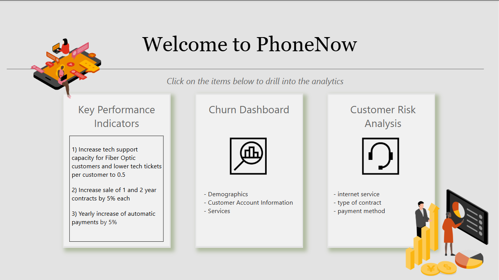
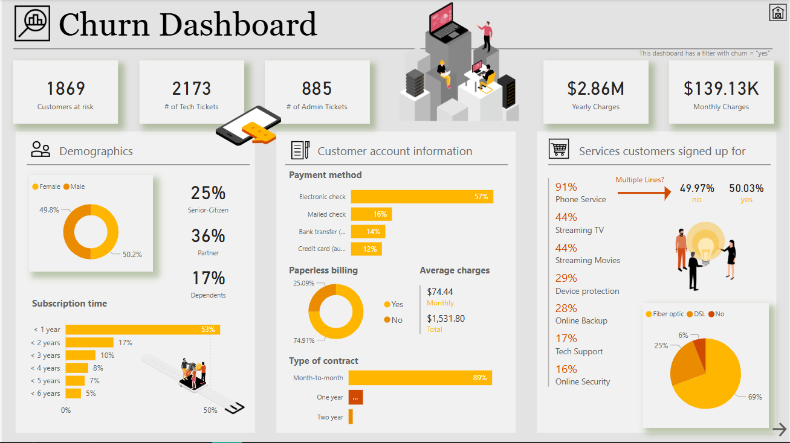
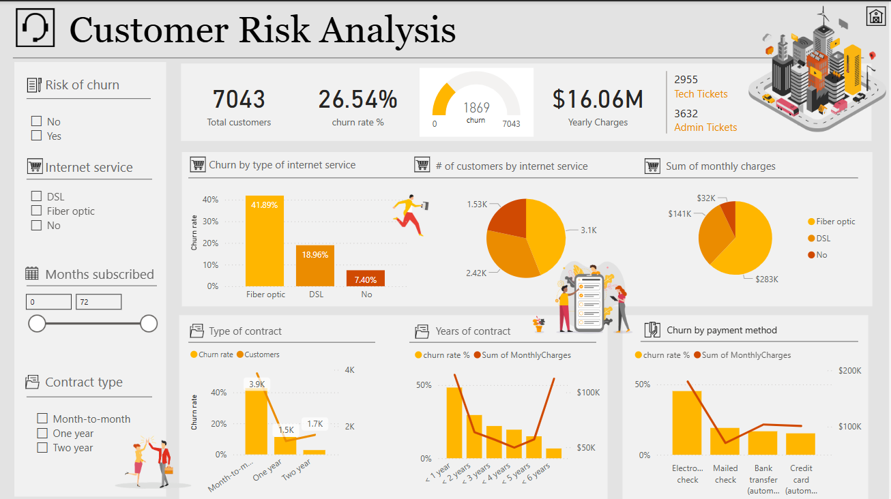

# 📉 Customer Churn Analysis & Retention Dashboard | Power BI

## 🧠 Problem Statement

**PhoneNow**, a telecom service provider, has observed a rise in customer churn, impacting revenue and long-term sustainability. The company wants to identify:

- Who is churning and why?
- Which customer segments are most at risk?
- What services or account attributes correlate with churn?
- How can data-driven strategies improve retention?

I created a Power BI dashboard to analyze churn behavior and support strategic decision-making to improve retention.

---

## 🔧 Tools Used

- **Power BI Desktop** for data modeling and visualization  
- **DAX** for calculated columns, measures, and KPIs  
- **Power Query Editor** for data cleaning and shaping  
- **Interactive Drillthroughs, Filters, and Navigation**

---

## 🧭 Navigation

The dashboard consists of **three main pages**:

1. **Welcome Page (Navigation + KPIs)**
2. **Churn Dashboard (Customer Attributes)**
3. **Customer Risk Analysis (Behavioral Insights)**

---

## 📌 Key Performance Indicators (KPIs)

The welcome page defines PhoneNow’s strategic goals:

1. Reduce tech support tickets per fiber optic customer to **≤ 0.5**
2. Increase **1-year** and **2-year contracts** sales by **5% each**
3. Increase **automatic payment adoption** by **5% annually**

These KPIs guide the dashboard's analytical focus and drive recommended actions.  

---

## 📊 Churn Dashboard Overview

This page provides a breakdown of **demographics, account info, and subscribed services** of customers flagged as "at risk".

### ✅ Key Cards

- **1869** customers at risk of churn  
- **2173** tech tickets, **885** admin tickets (indicating service burden)  
- **$2.86M** yearly and **$139.13K** monthly revenue potentially at risk  

---

### 👥 Demographics

- **Gender**: Almost evenly split between Male (50.2%) and Female (49.8%)
- **Senior Citizens**: 25% of churned users
- **Partners & Dependents**: 36% and 17% respectively
- **Subscription Time**: 53% churned within the **first year**, highlighting poor early retention

⏱️ **Insight**: Retention efforts should focus heavily on **first-year onboarding**.

---

### 🏦 Customer Account Information

- **Payment Method**:
  - **57%** use electronic checks (highest churn rate)
  - Other methods: Mailed check (16%), Bank transfer (14%), Credit card (12%)
- **Paperless Billing**: 75% say **No**, suggesting digital engagement is low
- **Average Monthly Charges**: $74.44  
- **Contract Type**:  
  - **89%** are on **Month-to-Month contracts**, most prone to churn

📌 **Recommendation**: Incentivize longer-term contracts and auto-pay methods to reduce churn.

---

### 🛠️ Services Subscribed

- **Phone Service**: 91% have it
- **Streaming TV/Movies**: 44% each
- **Multiple Lines**: ~50% split between Yes and No
- **Internet**: 69% use Fiber Optic (most churn-prone)

📡 **Key Note**: Fiber Optic users are driving churn — support and reliability need review.  

---

## 📉 Customer Risk Analysis

This page analyzes churn trends based on **service behavior, payment methods, and contract type**.

### 🔍 Overview Stats

- **7043** total customers  
- **26.54% churn rate**  
- **$16.06M** yearly charges  
- **2955** tech tickets, **3632** admin tickets  

---

### 🌐 Internet Service & Churn

- **Churn by Service Type**:
  - **Fiber Optic**: 41.89% churn rate
  - **DSL**: 18.96%
  - **No Internet**: 7.4%

📌 **Focus Area**: Fiber Optic service is a **churn hotspot** — tech support and service quality must be enhanced.

---

### 📅 Months Subscribed & Years of Contract

- Most churners subscribed for **< 1 year**
- Churn rate **drops significantly** with 1-year and 2-year contracts

📌 **Retention Strategy**: Upsell to 1–2 year contracts early in customer lifecycle

---

### 💳 Churn by Payment Method

- **Electronic Check** users show highest churn
- Other methods show better retention, especially credit cards

📌 **Actionable Insight**: Promote automatic card payments for better engagement and lower churn.  

---

## 📎 Files Included

- `Customer Retention.pbix` – Complete Power BI Dashboard
- Dataset used for analysis
- PNG screenshots of:
  - Welcome Page
  - Churn Dashboard
  - Customer Risk Analysis## 🧑‍💼 About Me
 
  ---
## 🧑‍💼 About Me  

**Kanishque Yadav**  
📧 kanishqueyadav06@gmail.com  
🔗 [LinkedIn](https://www.linkedin.com/in/kanishqueyadav/)

